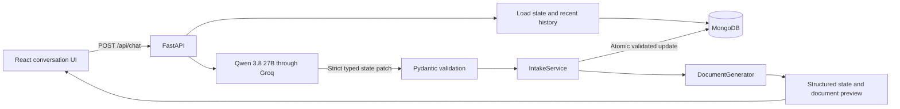

# Document Intake Assistant

## Project overview

Document Intake Assistant is a conversational web application that collects information for a fictional Personal Wishes Document. A user writes naturally, the application converts each message into a validated structured-state update, and the UI shows both the saved information and a live document preview.

The project demonstrates reliable LLM integration: the language model interprets intent, while deterministic backend code owns validation, state changes, persistence, and document generation.


## Key features

- Conversational intake for name, address, worldwide assets, children, executor, gifts, and additional wishes
- Corrections and ordered collection operations such as add, remove, replace, clear, and unknown
- Strict Groq JSON Schema output validated with Pydantic
- Atomic state updates: invalid or ambiguous changes do not partially modify saved data
- Case-insensitive deduplication and exact-removal checks for list-like fields
- Clarifying questions when the request is ambiguous or conflicts with saved information
- MongoDB-backed session state and recent conversation history
- Live structured-information panel and server-generated document preview
- Qwen 3.8 27B through Groq with a 500-token output cap and reset-aware rate-limit handling

## Tech stack

| Layer | Technology |
| --- | --- |
| Frontend | React 19, Vite 8, CSS |
| Backend API | Python 3.11, FastAPI, Uvicorn |
| Validation | Pydantic 2, pydantic-settings |
| LLM | Groq Python SDK with strict structured outputs |
| Persistence | MongoDB through Motor/PyMongo |
| Testing | pytest, HTTPX |

The frontend toolchain requires Node.js `^20.19.0` or `>=22.12.0`, as specified by the installed Vite toolchain.

## Architecture



For each chat message, FastAPI loads the session's structured state and conversation from MongoDB. Qwen receives the current state, latest user message, and most recent assistant turn, then returns a typed patch rather than a completed document. Pydantic validates the response, and `IntakeService` applies its operations to a copy of the current state. Missing removals, conflicting child information, and other invalid transitions produce a clarification without changing the stored record. After a valid update, MongoDB saves the state and the most recent 12 conversation messages. `DocumentGenerator` renders the preview exclusively from validated structured state.

## Project structure

```text
.
├── backend/
│   ├── app/
│   │   ├── main.py                # FastAPI routes and request workflow
│   │   ├── models.py              # State, API, and LLM patch schemas
│   │   ├── llm_service.py         # Groq structured-output integration
│   │   ├── service.py             # Atomic state-transition rules
│   │   ├── mongo_service.py       # MongoDB session persistence
│   │   ├── document_generator.py  # Plain-text document preview
│   │   └── config.py              # Environment-based settings
│   ├── tests/                     # API, state, and LLM contract tests
│   └── requirements.txt
├── frontend/
│   ├── src/                       # React application and styles
│   ├── public/                    # Static assets
│   ├── package.json
│   ├── package-lock.json
│   └── vite.config.js
├── .env.example                   # Safe environment-variable template
├── .gitignore
└── AI_LOG.md                      # Development notes
```

## Prerequisites

- Python 3.11 or later
- Node.js `^20.19.0` or `>=22.12.0`
- npm
- A Groq API key
- A reachable MongoDB deployment and connection URI

## Environment variables

Copy `.env.example` to `.env` in the repository root:

```powershell
Copy-Item .env.example .env
```

Then provide your own credentials locally. Never commit `.env`; it is ignored by Git.

| Variable | Required | Purpose |
| --- | --- | --- |
| `GROQ_API_KEY` | Yes | Authenticates requests to Groq |
| `GROQ_MODEL` | No | Primary model; defaults to `qwen/qwen3.8-27b` |
| `MONGODB_URI` | Yes | MongoDB connection URI used for session persistence |
| `FRONTEND_ORIGINS` | No | Comma-separated CORS origins; defaults to local Vite URLs |

The application reads `.env` from the repository root. `.env.example` contains names and safe defaults only.

## Setup and run

The following PowerShell commands match the repository layout.

### 1. Backend setup

From the repository root:

```powershell
python -m venv .venv
.\.venv\Scripts\Activate.ps1
python -m pip install -r backend\requirements.txt
```

On macOS or Linux, activate the environment with `source .venv/bin/activate` and use `/` in paths.

### 2. Frontend setup

```powershell
cd frontend
npm ci
cd ..
```

### 3. Start the backend

Open a terminal with the root virtual environment activated:

```powershell
cd backend
uvicorn app.main:app --reload --host 127.0.0.1 --port 8000
```

The API is available at `http://127.0.0.1:8000`. Health status is available at `http://127.0.0.1:8000/api/health`.

### 4. Start the frontend

Open a second terminal:

```powershell
cd frontend
npm run dev -- --host 127.0.0.1 --port 5173
```

Open `http://127.0.0.1:5173` in a browser. The frontend sends chat requests to `http://127.0.0.1:8000`.

## Tests and build

Run backend tests from the `backend` directory with the root virtual environment:

```powershell
cd backend
..\.venv\Scripts\python.exe -m pytest -q
```

Run frontend checks from the `frontend` directory:

```powershell
cd frontend
npm run lint
npm run build
```

The current backend suite contains 15 tests covering API persistence, atomic state transitions, collection operations, clarification behavior, strict model-output validation, safe rate-limit handling, and model repair handling.

## API endpoints

| Method | Endpoint | Purpose |
| --- | --- | --- |
| `GET` | `/api/health` | Reports API status, Mongo availability, and application revision |
| `POST` | `/api/chat` | Processes a message for a supplied `session_id` |
| `GET` | `/api/state?session_id=...` | Returns saved structured state |
| `GET` | `/api/document?session_id=...` | Returns the generated document preview |

## Engineering decisions and reliability

- **Structured state is authoritative.** Conversation text helps interpretation but is not the saved record.
- **The model proposes; the backend decides.** Groq returns typed operations, while backend code validates and applies them.
- **Updates are atomic.** Clarifications and failed validations preserve the previous state.
- **Collections use ordered operations.** One message can safely combine additions, removals, replacements, and clearing.
- **Provider output is constrained.** Groq uses strict JSON Schema, followed by Pydantic and domain validation.
- **Requests are bounded.** The normal path makes one Groq request with a 500-token output limit and only the latest necessary conversation context.
- **Failures are explicit.** Rate limits return HTTP 429, service failures return HTTP 503, and saved data remains unchanged.
- **Rate limits do not create request bursts.** The backend does not call a fallback model or immediately retry HTTP 429 responses. It honors Groq's reset information and suppresses provider calls during the cooldown.
- **Document text is derived data.** The preview is generated from validated state rather than directly from LLM prose.

## Known limitations

- The application depends on external Groq and MongoDB availability; there is no offline mode.
- Groq organization or model quotas can still return HTTP 429. The backend preserves state and reports the provider's reset time.
- The frontend API URL is currently fixed to `http://127.0.0.1:8000`.
- MongoDB stores the 12 most recent conversation messages, while each LLM request sends only the most recent assistant turn needed to interpret the latest user message.
- Sessions use client-generated IDs and do not include authentication or user ownership.
- The document preview is plain text and is not a downloadable legal document.
- This is a fictional intake demonstration, not legal advice.

## Production improvements

- Add authentication, session ownership, and authorization controls.
- Make the frontend API URL deployment-configurable.
- Add a unique MongoDB index for `session_id` and formal data migrations.
- Add end-to-end browser tests and deployed-environment integration tests.
- Add structured observability, request tracing, provider metrics, and alerting.
- Add secure secret management, containerized deployment, and CI/CD checks.
- Add export formats and an explicit review/confirmation step before finalizing a document.
